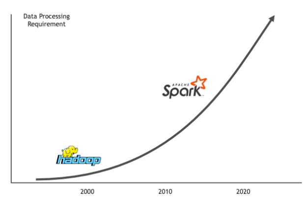

# Welcome to DS-610 - Big Data Analytics



- [Welcome to DS-610 - Big Data Analytics](#welcome-to-ds-610---big-data-analytics)
  - [Introduction](#introduction)
  - [Concepts & Tools](#concepts--tools)
    - [Git](#git)
    - [SQL](#sql)
    - [Python](#python)
    - [Development Tools (IDEs)](#development-tools-ides)
    - [Code Sharing Platforms (GitHub)](#code-sharing-platforms-github)
    - [Google Colab](#google-colab)
  - [Installing Spark](#installing-spark)
  - [How You Will Do Assignments](#how-you-will-do-assignments)
  - [How Does Autograder Work?](#how-does-autograder-work)
  - [Todo List](#todo-list)
  - [Conclusion](#conclusion)

## Introduction

<!-- Introducing the class, basic information on this repository -->

You made it! This is our start of a journey for the next few months!

This repository is your guide and orientation of the way we will be doing things in this class! In this repository, we will go over on GitHub, and basic use of python. You can use this place as a guide to find useful links related with this class.

## Concepts & Tools 

<!-- Concepts needs to be covered before getting into class content -->

Things you will need to get yourself familiar with. Following is the stuff you need to be prepared for to fully cooperate on this class.

### Git

<!-- The version control system -->

The assignments are stored and shared using [GitHub](https://github.com/) and we use [Git](https://git-scm.com/) to be able to version and interact with our repositories.

My recommendation is go over the following stuff.

- Your first steps towards Git, [Learn to use Git](https://guides.github.com/activities/hello-world/)
- Learn GitHub and Git using GitHub Lab, [Github Lab](https://lab.github.com/)
- Useful to understand how Git works, [Git Cheat Sheet](https://education.github.com/git-cheat-sheet-education.pdf)
- Useful to understand how GitHub works, [Github Flow](https://enterprise.github.com/downloads/en/-github-flow-cheatsheet.pdf)
- Useful for your README.md files, [Github Flawored Markdown Cheat Sheet](https://enterprise.github.com/downloads/en/markdown-cheatsheet.pdf)
- Protips from Data Scientist at GitHub, [Tips, tricks, hacks, and secrets from Alyson La](https://github.blog/2020-04-23-github-protips-tips-tricks-hacks-and-secrets-from-alyson-la/)
- A simple git learning experience with a desktop app, [Git-it (Desktop App)](https://github.com/jlord/git-it-electron)
- A set of tutorials, [Get Git Right by Atlassian](https://www.atlassian.com/git)
- Overwhelmed by git command line, what about an app? [Sourcetree](https://www.sourcetreeapp.com/)

### SQL

SQL is the heartbeat of your Analytical life! You need to know it to some extend! Following are some links to check out.

- Learn the syntax, [W3Schools SQL Tutorial](https://www.w3schools.com/sql/)
- Interactive Online SQL Learning Tool, [SQLBolt](https://sqlbolt.com/)
- Free class on SQL, [CodeAcademy SQL](https://www.codecademy.com/learn/learn-sql)

### Python

<!-- THe programming language we will be using a lot, a lot. -->

In this course, we use Python. You can use either [standard python](https://www.python.org/), or [anaconda distribution](https://www.anaconda.com/distribution/), up to your preference.

It is better to know Python syntax, even tough we will be covering it in the class.

- Learn the syntax, [W3Schools Python Tutorial](https://www.w3schools.com/python/default.asp)
- Online Tool to Learn Python, [learnpython.org](https://www.learnpython.org/)
- A rather broader place to learn Python, [Geek for Geeks](https://www.geeksforgeeks.org/python-programming-language/)

### Development Tools (IDEs)

<!-- VSCode and advantages -->

My favorite, bittersweet tool, [Visual Studio Code](https://code.visualstudio.com/), use it and you'll love it!

Install VSCode to your computer. Add the following extensions as well.
  - [Pylance](https://marketplace.visualstudio.com/items?itemName=ms-python.vscode-pylance) a new language server from Microsoft.
  - [Python](https://marketplace.visualstudio.com/items?itemName=ms-python.python) to enable intellisense, environment management, etc.
  - [Markdown PDF](https://marketplace.visualstudio.com/items?itemName=yzane.markdown-pdf) for getting used to Markdown syntax.
  - [Live Code](https://marketplace.visualstudio.com/items?itemName=MS-vsliveshare.vsliveshare) to interact with each other.

Even tough are a lot of online resoources available to make the most out of VSCode, recently Microsoft introduced a new set of articles to [learn to code with Visual Studio Code](https://code.visualstudio.com/learn). **Utilize this** to get yourself familiar with VS Code and understand why tools like VS Code are much better than just a text editor.

There are alternatives of course, you are welcome to use those as well. The point is an IDE will make your life much easier if you choose to use one!

Alternatives

- [Atom](https://atom.io/)
- [Notepad++](https://notepad-plus-plus.org/) (I use it as an advanced Notepad, rather than an IDE) 
- [Sublime](https://www.sublimetext.com/)
- And many, many more over [here](https://www.google.com/search?q=integrated+development+editor).

Development tools from your browser!

- [Your instant dev environment in GitHub](https://github.com/features/codespaces)
- [An instant IDE and prototyping tool for rapid web development.](https://codesandbox.io/)

### Code Sharing Platforms (GitHub)

<!-- GitHub in brief -->

[GitHub](https://github.com/) is how people build software. It has over 100 million repositories hosted in its platform as of August 2019, and its an essential tool for collaboration and sharing.

- [Introduction to GitHub, by GitHub](https://lab.github.com/githubtraining/introduction-to-github)
- [An Introduction to GitHub by US Government!](https://digital.gov/resources/an-introduction-github/)
- [A Dead Simple Intro to GitHub for the Non-Technical](https://medium.com/crowdbotics/a-dead-simple-intro-to-github-for-the-non-technical-f9d56410a856)
  
### Google Colab

Colaboratory is built on top of Jupyter Notebook. 

- [basic_features_overview.ipynb](https://colab.research.google.com/notebooks/basic_features_overview.ipynb)
- [welcome.ipynb](https://colab.research.google.com/notebooks/welcome.ipynb)

## Installing Spark

Following are some of the tools you can utilize for doing the assignments on this course.

| Tool                         | Owner                          | Description                                                                                                        | How to Guide                                                                                                                                                                                                                                    |
| ---------------------------- | ------------------------------ | ------------------------------------------------------------------------------------------------------------------ | ----------------------------------------------------------------------------------------------------------------------------------------------------------------------------------------------------------------------------------------------- |
| Google Colab                 | Google                         | Colaboratory is built on top of Jupyter Notebook.                                                                  | [basic_features_overview.ipynb](https://colab.research.google.com/notebooks/basic_features_overview.ipynb), [welcome.ipynb](https://colab.research.google.com/notebooks/welcome.ipynb)                                                          |
| Databricks Community Edition | DataBricks                     | Databricks is a micro-cluster as well as a cluster manager and notebook environment.                               | [FAQ](https://databricks.com/product/faq/community-edition), [Login to Community Edition](https://community.cloud.databricks.com/login.html)                                                                                                    |
| Data Science Lab             | Saint Peter's University (SPU) | SPU's computation resource is a cluster of workstations that can work together as one big systems. Be proud of it! | [Website](https://dsl.saintpeters.edu/), [How do you ...](https://dsl.saintpeters.edu/doku.php?id=how_do_i)                                                                                                                                     |
| Local Install                | You                            | Your local computer. Install JVM, Spark, PySpark, etc.                                                             | [ssh](https://en.wikipedia.org/wiki/Secure_Shell), [Putty (for windows users)](https://www.chiark.greenend.org.uk/~sgtatham/putty/), [Jupyter Notebooks](https://jupyter.org/), [Anaconda Distribution](https://www.anaconda.com/distribution/) |
| Using Docker                 | You                            | Install Spark as a container on your computer! Fancy?                                                              | Download [docket desktop](https://www.docker.com/products/docker-desktop) application, [docker-compose](https://docs.docker.com/compose/), [big-data-europe/docker-spark](https://github.com/big-data-europe/docker-spark)                      |

## How You Will Do Assignments

We use Github Classroom for assignments. Basically, how it works is described in down.

1. I give you a link.
2. You click on a link, and you are hacked, and I demand for a small randsom!
3. Ignore the second step, you click the link, it will automatically create a repository for you under our GitHub webpage.
4. You download this repository using `git clone https://github.com/..../welcome.git`.
5. You work on the assignment, do a few commits, and `git push` it to GitHub.
6. When you are done with the assignment, you go back to your repository, and **download** it as ZIP, and upload it to the [blackboard](https://saintpeters.blackboard.com/).
7. I read it after the deadline passes, and give you a big `0`.
8. Ignore the 7th step, you will be graded properly.

## How Does Autograder Work?

Some assignments will have autograding enabled, which will run some tests against your code. If you successfully complete all parts of the assignment, these checks will pass, if not you will get an error stating what failed.

Let's see this in [spu-bigdataanalytics-212/assignment-0-metinsenturk](https://github.com/spu-bigdataanalytics-212/assignment-0-metinsenturk/) sample repository.

1. [Here is the version](https://github.com/spu-bigdataanalytics-212/assignment-0-metinsenturk/tree/57f23ecb7ff32bb62514432f0e1dd0575e4a5e78) of this repo right after it gets created. 
2. At this point, [tests](https://github.com/spu-bigdataanalytics-212/assignment-0-metinsenturk/runs/2651016640) are failing, since we just created it.
3. After adding necessary code, GitHub runs the test code.
4. Result of the test code appears [here](https://github.com/spu-bigdataanalytics-212/assignment-0-metinsenturk/runs/2651023019#step:3:33) under `Run education/autograding@v1` group.

Check out more about this in [assignment-0-metinsenturk/actions](https://github.com/spu-bigdataanalytics-212/assignment-0-metinsenturk/actions).

You can also test your code in your local computer before upload using [unittest](https://docs.python.org/3/library/unittest.html) package.

> python -m unittest -v test_my_code.py 

If all goes well, this will print something like this.

```
test_import_module (test_my_code.TestMyCode) ... ok
test_number_of_functions (test_my_code.TestMyCode) ... ok

----------------------------------------------------------------------
Ran 2 tests in 0.001s

OK
```

## Todo List

<!-- A list of items for student to follow -->

1. Make a python file with name `my_code.py`.
2. Create at least 2 functions for practice.
3. Check out [test_my_code.py](test_my_code.py) file. This file will test your code once you upload to GitHub!
4. Upload to GitHub once you are done.
5. Go to your repository and check `Actions` tab. After every commit you make, GitHub runs `test_my_code.py` file to validate if your code is satisfactory. See example of an output in my [assignment-0-metinsenturk/actions](https://github.com/spu-bigdataanalytics-212/assignment-0-metinsenturk/actions).
6. Click the green button at the top of the repo, and do `Download ZIP`.
7. As a practice, **download your repository** and **upload it to blackboard** as your first assignment!
8. That's it.

## Conclusion

<!-- The takeaway of this repository and whats next. -->

That's it! To a wonderful semester, 

Happy coding!
